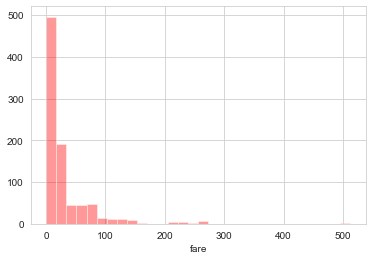
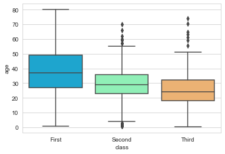
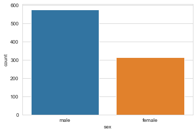

# Seaborn Ejercicios - Solución

¡Es hora de practicar tus nuevas habilidades en Seaborn! Intenta recrear los gráficos a continuación (no se te preocupes por los esquemas de color, solo el gráfico en si mismo).

## Datos

Trabajaremos con un famoso conjunto de datos del Titanic para estos ejercicios. Nos centraremos en la visualización de los datos con Seaborn:


```python
import seaborn as sns
import matplotlib.pyplot as plt
%matplotlib inline
```


```python
sns.set_style('whitegrid')
```


```python
titanic = sns.load_dataset('titanic')
```


```python
titanic.head()
```


<div>
<table border="1" class="dataframe">
  <thead>
    <tr style="text-align: right;">
      <th></th>
      <th>survived</th>
      <th>pclass</th>
      <th>sex</th>
      <th>age</th>
      <th>sibsp</th>
      <th>parch</th>
      <th>fare</th>
      <th>embarked</th>
      <th>class</th>
      <th>who</th>
      <th>adult_male</th>
      <th>deck</th>
      <th>embark_town</th>
      <th>alive</th>
      <th>alone</th>
    </tr>
  </thead>
  <tbody>
    <tr>
      <th>0</th>
      <td>0</td>
      <td>3</td>
      <td>male</td>
      <td>22.0</td>
      <td>1</td>
      <td>0</td>
      <td>7.2500</td>
      <td>S</td>
      <td>Third</td>
      <td>man</td>
      <td>True</td>
      <td>NaN</td>
      <td>Southampton</td>
      <td>no</td>
      <td>False</td>
    </tr>
    <tr>
      <th>1</th>
      <td>1</td>
      <td>1</td>
      <td>female</td>
      <td>38.0</td>
      <td>1</td>
      <td>0</td>
      <td>71.2833</td>
      <td>C</td>
      <td>First</td>
      <td>woman</td>
      <td>False</td>
      <td>C</td>
      <td>Cherbourg</td>
      <td>yes</td>
      <td>False</td>
    </tr>
    <tr>
      <th>2</th>
      <td>1</td>
      <td>3</td>
      <td>female</td>
      <td>26.0</td>
      <td>0</td>
      <td>0</td>
      <td>7.9250</td>
      <td>S</td>
      <td>Third</td>
      <td>woman</td>
      <td>False</td>
      <td>NaN</td>
      <td>Southampton</td>
      <td>yes</td>
      <td>True</td>
    </tr>
    <tr>
      <th>3</th>
      <td>1</td>
      <td>1</td>
      <td>female</td>
      <td>35.0</td>
      <td>1</td>
      <td>0</td>
      <td>53.1000</td>
      <td>S</td>
      <td>First</td>
      <td>woman</td>
      <td>False</td>
      <td>C</td>
      <td>Southampton</td>
      <td>yes</td>
      <td>False</td>
    </tr>
    <tr>
      <th>4</th>
      <td>0</td>
      <td>3</td>
      <td>male</td>
      <td>35.0</td>
      <td>0</td>
      <td>0</td>
      <td>8.0500</td>
      <td>S</td>
      <td>Third</td>
      <td>man</td>
      <td>True</td>
      <td>NaN</td>
      <td>Southampton</td>
      <td>no</td>
      <td>True</td>
    </tr>
  </tbody>
</table>
</div>


# Ejercicios


** Recrea los gráficos que a continuación se muestran, utilizando el dataframe "titanic". Hay muy pocas sugerencias ya que la mayoría de los trazados se pueden hacer con solo una o dos líneas de código y una sugerencia básicamente daría la solución. Presta especial atención a las etiquetas x e y para obtener pistas. **

** ¡Nota! Para no perder la imagen del diagrama, asegúrate de no codificar en la celda que está directamente arriba del diagrama, ¡hay una celda adicional arriba de esa que no sobrescribirá ese diagrama! **


```python
# Escribe tu código
```


```python
sns.jointplot(x='fare',y='age',data=titanic)
```


    <seaborn.axisgrid.JointGrid at 0x12581bd6978>


```python
sns.distplot(titanic['fare'],bins=30,kde=False,color='red')
```


    <matplotlib.axes._subplots.AxesSubplot at 0x12581d205c0>





```python
# Escribe tu código
```


```python
sns.boxplot(x='class',y='age',data=titanic,palette='rainbow')
```


    <matplotlib.axes._subplots.AxesSubplot at 0x12581e58940>





```python
# Escribe tu código
```


```python
sns.swarmplot(x='class',y='age',data=titanic,palette='Set2')
```


    <matplotlib.axes._subplots.AxesSubplot at 0x12581fac438>


```python
# Escribe tu código
```


```python
sns.countplot(x='sex',data=titanic)
```


    <matplotlib.axes._subplots.AxesSubplot at 0x12582007828>





```python
# Escribe tu código
```


```python
sns.heatmap(titanic.corr(),cmap='coolwarm')
plt.title('titanic.corr()')
```


    Text(0.5, 1, 'titanic.corr()')


```python
# Escribe tu código
```


```python
g = sns.FacetGrid(data=titanic,col='sex')
g.map(plt.hist,'age')
```


    <seaborn.axisgrid.FacetGrid at 0x12581fa3400>


# ¡Buen trabajo!
