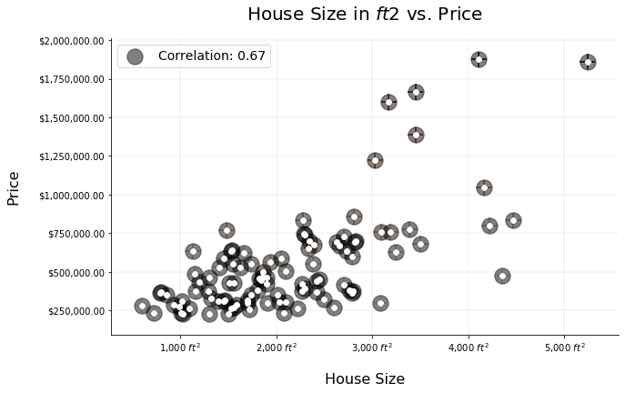

# Visualización de Datos

## MATPLOTLIB

### Instalación:

- conda install matplotlib
- pip install matplotlib


```python
import matplotlib.pyplot as plt
%matplotlib inline
import numpy as np
```

### Gráfico Básico:

```python
# Se grafican las curvas del seno y coseno, entre -pi y pi
X = np.linspace(-np.pi, np.pi, 300, endpoint=True)
s,c = np.sin(X), np.cos(X)
plt.figure(figsize=(4,4))
plt.plot(X,s,color="red", linewidth=2, linestyle="--")
plt.plot(X,c,color="blue", linewidth=1, linestyle="-")
plt.show()
```


### Estableciendo límites:


```python
# Se definen los límites de los ejes
plt.xlim(X.min()*1.2, X.max()*1.2)
plt.ylim(c.min()*1.1, c.max()*1.1)
plt.plot(X,s,color="red", linewidth=2, linestyle="--")
plt.plot(X,c,color="blue", linewidth=1, linestyle="-")
plt.show()
```


### Configurando las etiquetas:


```python
# Se cambian las etiquetas, para mostrar los valores de pi en el eje de las x y
# cambiar los intervalos en el eje de las y
plt.xticks( [-np.pi, -np.pi/2, -np.pi/4, 0, np.pi/4, np.pi/2, np.pi])
plt.yticks([-1, -0.5, 0, 0.5, +1])
plt.plot(X,s,color="red", linewidth=2, linestyle="--")
plt.plot(X,c,color="blue", linewidth=1, linestyle="-")
plt.show()
```


### Configurando máscaras para las etiquetas:


```python
# Se cambian las etiquetas en el eje de las x, para mostrar el símbolo de pi
plt.xticks([-np.pi, -np.pi/2, -np.pi/4, 0, np.pi/4, np.pi/2, np.pi],
       [r'$-\pi$', r'$-\pi/2$', r'$-\pi/4$',r'$0$', r'$-\pi/4$',r'$+\pi/2$', r'$+\pi$'])
plt.plot(X,s,color="red", linewidth=2, linestyle="--")
plt.plot(X,c,color="blue", linewidth=1, linestyle="-")
plt.show()
```


### Agregamos una leyenda:


```python
# Se agregan leyendas para identificar a que corresponde cada curva
plt.plot(X, c, color="blue", linewidth=2, linestyle="--", label="Cosine")
plt.plot(X, s, color="red",  linewidth=1.5, linestyle="-", label="Sine")

plt.legend(loc='best',frameon=True)
```


    <matplotlib.legend.Legend at 0x1f21abb9128>


### Dibujando Áreas Acumulativas:

```python
# Se llenan las áreas que se encuentran entre dos curvas
plt.fill_between(X, 0, c, c > 0, color='blue', alpha=.25)
plt.fill_between(X, -1, s, s < 0, color='red',  alpha=.25)
```


    <matplotlib.collections.PolyCollection at 0x1f21afda400>


### SubPlots and Ejes:


```python
# Se agregan gráficas adicionales
x1 = np.linspace(0,5,20)
y1 = x1** - x1
plt.subplot(1,2,1)
plt.plot(x1, y1, 'r--')
plt.subplot(1,2,2)
plt.plot(x1, y1, 'g*-')
```


    [<matplotlib.lines.Line2D at 0x1f21ca28630>]


### Metodo Orientado a Objetos:


```python
x = np.linspace(-5,5,20)
fig, axes = plt.subplots(nrows=1, ncols=3,figsize=(10, 5))

axes[0].plot(x, x**2 - x, x, x**2)
axes[0].set_title("Polynomial Functions")

axes[1].plot(x, x**2 - 0.5, x, x**3-x**2-0.5)
axes[1].set_title("Polynomial Functions")

axes[2].plot(x, x*2+0.5, x, x**2)
axes[2].set_ylim([0, 30])
axes[2].set_xlim([0, 5])
axes[2].set_title("Polynomial Functions")
```


    Text(0.5, 1.0, 'Polynomial Functions')


### Texto:


```python
# Se agregan textos a las gráficas
axes[2].text(3, 5, r"$y=2x+0.5$", fontsize=15, color="blue")
axes[2].text(2.5, 10, r"$y=x^2$", fontsize=15, color="green")
fig
```


### Salvar el grafico:


```python
fig.savefig('data/savefig.png',dpi=600)
```

### Insertar imagenes:

- Una imagen en color se puede representar como una matriz N x M x 3 correspondiente a N filas, M columnas y 3 canales o colores para el rojo, verde y azul en la representación RGB. También podría ser de 4 canales, debido al canal de transparencia  con una notación N x M x 4.


```python
import matplotlib.image as mpimg
```


```python
img=mpimg.imread('data/savefig.png')
img.shape
```


    (3000, 6000, 4)


```python
# Mostrando la imagen con imshow
plt.imshow(img)
plt.colorbar()
```


    <matplotlib.colorbar.Colorbar at 0x1f2493cf320>


## Personalización de Gráficos


```python
# Importemos otras librerias de Matplotlib
import matplotlib.pyplot as plt
import matplotlib.ticker as mtick
import pandas as pd
%matplotlib inline
```

### Carguemos los datos
dataset: https://www.kaggle.com/shivachandel/kc-house-data

Este conjunto de datos es otro de los más conocidos dentro de la comunidad de Machine Learning.
El conjunto original (Boston Housing) contiene los precios y las características de varias casas ubicadas en Boston, recolectadas por el Censo de EEUU.

Esta variante contiene datos históricos de casas del Condado King (en Washington), que fueron vendidas entre mayo de 2014 y 2015.

En base a la combinación de las características, se buscan modelos que permitan predecir el precio de una casa.
Algunas de las características son: número de habitaciones, número de baños, pies cuadrados construidos, pies cuadrados totales, número de pisos, código postal.


```python
# Se cargan los datos a partir del archivo y se crea un dataframe con una muestra de 100 casas
data = pd.read_csv('data/kc_house_data.csv')
df = data.sample(100)
df.head()
```


<div>
<table border="1" class="dataframe">
  <thead>
    <tr style="text-align: right;">
      <th></th>
      <th>id</th>
      <th>date</th>
      <th>price</th>
      <th>bedrooms</th>
      <th>bathrooms</th>
      <th>sqft_living</th>
      <th>sqft_lot</th>
      <th>floors</th>
      <th>waterfront</th>
      <th>view</th>
      <th>...</th>
      <th>grade</th>
      <th>sqft_above</th>
      <th>sqft_basement</th>
      <th>yr_built</th>
      <th>yr_renovated</th>
      <th>zipcode</th>
      <th>lat</th>
      <th>long</th>
      <th>sqft_living15</th>
      <th>sqft_lot15</th>
    </tr>
  </thead>
  <tbody>
    <tr>
      <th>1702</th>
      <td>8651402920</td>
      <td>20140505T000000</td>
      <td>219900.0</td>
      <td>4</td>
      <td>1.50</td>
      <td>1120</td>
      <td>5427</td>
      <td>1.0</td>
      <td>0</td>
      <td>0</td>
      <td>...</td>
      <td>6</td>
      <td>1120.0</td>
      <td>0</td>
      <td>1969</td>
      <td>2014</td>
      <td>98042</td>
      <td>47.3628</td>
      <td>-122.087</td>
      <td>1150</td>
      <td>5304</td>
    </tr>
    <tr>
      <th>21427</th>
      <td>1085623630</td>
      <td>20141003T000000</td>
      <td>436952.0</td>
      <td>4</td>
      <td>2.50</td>
      <td>2708</td>
      <td>4772</td>
      <td>2.0</td>
      <td>0</td>
      <td>0</td>
      <td>...</td>
      <td>9</td>
      <td>2708.0</td>
      <td>0</td>
      <td>2014</td>
      <td>0</td>
      <td>98092</td>
      <td>47.3413</td>
      <td>-122.178</td>
      <td>2502</td>
      <td>4900</td>
    </tr>
    <tr>
      <th>3213</th>
      <td>2028700265</td>
      <td>20150115T000000</td>
      <td>505000.0</td>
      <td>2</td>
      <td>1.75</td>
      <td>1310</td>
      <td>3816</td>
      <td>1.0</td>
      <td>0</td>
      <td>0</td>
      <td>...</td>
      <td>7</td>
      <td>1110.0</td>
      <td>200</td>
      <td>1929</td>
      <td>0</td>
      <td>98117</td>
      <td>47.6790</td>
      <td>-122.368</td>
      <td>1510</td>
      <td>3816</td>
    </tr>
    <tr>
      <th>13242</th>
      <td>1392800035</td>
      <td>20140618T000000</td>
      <td>559000.0</td>
      <td>2</td>
      <td>1.00</td>
      <td>1240</td>
      <td>6400</td>
      <td>1.0</td>
      <td>0</td>
      <td>1</td>
      <td>...</td>
      <td>7</td>
      <td>1060.0</td>
      <td>180</td>
      <td>1938</td>
      <td>0</td>
      <td>98126</td>
      <td>47.5493</td>
      <td>-122.377</td>
      <td>1240</td>
      <td>6400</td>
    </tr>
    <tr>
      <th>11606</th>
      <td>4139910030</td>
      <td>20150302T000000</td>
      <td>1300000.0</td>
      <td>5</td>
      <td>2.50</td>
      <td>4170</td>
      <td>33310</td>
      <td>2.0</td>
      <td>0</td>
      <td>0</td>
      <td>...</td>
      <td>11</td>
      <td>4170.0</td>
      <td>0</td>
      <td>1991</td>
      <td>0</td>
      <td>98006</td>
      <td>47.5455</td>
      <td>-122.126</td>
      <td>4670</td>
      <td>37960</td>
    </tr>
  </tbody>
</table>
<p>5 rows × 21 columns</p>
</div>


```python
# Se crean dataframes con los pies cuadrados construidos y el precio
x = df['sqft_living']
y = df['price']
```

### Visualizando los datos con Matplotlib predeterminado


```python
# Se grafican los pies cuadrados vs el precio
fig, ax = plt.subplots(figsize=(10,6))
ax.scatter(x, y, color='green')
```


    <matplotlib.collections.PathCollection at 0x1f25b386f98>


### Mejorando la visualización:


```python
# Removiendo bordes
ax.spines['top'].set_visible(False)
ax.spines['right'].set_visible(False)
fig
```


```python
# Usando Latex : www.latex-project.org
ax.set_title(r'House Size in $ft2$ vs. Price', fontsize=20, pad=20)
ax.set_xlabel('House Size', fontsize=16, labelpad=20)
ax.set_ylabel('Price', fontsize=16, labelpad=20)
fig
```


```python
# Adicionando etiquetas a los ejes
y_format = '${x:,.2f}'
y_tick = mtick.StrMethodFormatter(y_format)
ax.yaxis.set_major_formatter(y_tick)

x_format = r'{x:,.0f} $ft^2$'
x_tick = mtick.StrMethodFormatter(x_format)
ax.xaxis.set_major_formatter(x_tick)
fig
```


```python
# Cambiando el color, marcador, tamaño y transparencia
ax.scatter(x, y, s=200, marker='+', color='#FF5733', alpha=0.8)
fig
```


```python
# Adicionamos lineas al grid
ax.grid(color='grey', linestyle='-', linewidth=0.25, alpha=0.5)
fig
```


```python
# Aplicando mapas de colores
ax.scatter(x, y, s=300, c=y, marker='+', cmap='Greens', alpha=0.8)
fig
```


```python
ax.scatter(x, y, s=300, c=y, marker='+', cmap='Reds', alpha=0.8)
ax.scatter(x, y, color='black')
fig
```


```python
# Se obtiene la correlación entre los pies cuadrados y el precio
np.corrcoef(x, y)
```


    array([[1.       , 0.7922816],
           [0.7922816, 1.       ]])


```python
# Añadir leyenda: coeficiente de correlación
corr_ = np.round(np.corrcoef(x, y)[0][1], 2)
corr_
```


    0.79


```python
# Se utiliza el valor de la correlación como leyenda
ax.scatter(x, y, s=300, marker='o', color='black', alpha=0.5, label=f'Correlation: {corr_}')
ax.legend(fancybox=True, prop={'size': 14}, loc='best')
ax.scatter(x, y, color='w')
fig
```





## Gráficos y Estadísticos

### Dispersión


```python
# Se grafica y = x^2
x = np.linspace(-5,5,20)
y = x**2
plt.scatter(x,y, s=200, color='yellow',marker='.',edgecolors='black')
```


    <matplotlib.collections.PathCollection at 0x1f25ba7af60>


### Barras


```python
# Se crean 4 clases con diferentes valores para mostrar una gráfica de barras
classes = ['C1', 'C2', 'C3', 'C4']
colors  = ['#FF5733', '#3533FF', '#33FF5D', '#FDFF33']
numerical = [[10, 15, 5, 7],
             [1, 3, 4, 9],
             [4, 15, 8, 10],
             [7, 6, 13, 8]]

number_groups = len(classes)
bin_width = 0.2

fig, ax = plt.subplots(figsize=(8,6))

for i in range(number_groups):
    ax.bar(x=np.arange(len(classes)) + i*bin_width,
           height=numerical[i],
           width=bin_width,
           color=colors[i],
           align='center')

ax.set_xticks(np.arange(len(classes)) + 0.4)
ax.set_xticklabels(classes)
ax.legend(classes, facecolor='w', loc='best')
```


    <matplotlib.legend.Legend at 0x1f25cb6d908>


### Histogramas


```python
# Se genera una muestra de 50 valores para graficar un histograma
x = np.random.sample(50)
n, bins, patches = plt.hist(x, bins=20, facecolor='orange', alpha=0.7, density=True)
plt.setp(patches[3], 'facecolor', 'b')
plt.xlabel('bins')
plt.ylabel('Values')
plt.grid(color='grey', linestyle='-', linewidth=0.25, alpha=0.5)
```


### Pastel


```python
# Gráfica de pastel, en la que las rebanadas se encuentran ordenadas por su valor
# y se presentan en sentido contrario a las manecillas del reloj
labels = 'Segment 1', 'Segment 2', 'Segment 3', 'Segment 4'
sizes = [30, 35, 25, 10]  # porcentajes, la suma debe ser 100%
explode = (0, 0.1, 0, 0)  # solo separar la segunda rebanada (i.e. 'Segment 2')

fig, ax = plt.subplots()
ax.pie(sizes, explode=explode, labels=labels, autopct='%1.1f%%', shadow=True, startangle=90)
ax.axis('equal')  # el parámetro 'equal' asegura que el pastel se dibuje como un círculo
```


    (-1.1144509022638318,
     1.1312382101451997,
     -1.2210697990242716,
     1.1057652336712287)


### Cajas (Box plots)

* Q3: Este es el valor del percentil 75 (bisagra superior) de los datos.
* Q1: Este es el valor del percentil 25 (bisagra inferior) de los datos.
* Caja: es una diferencia entre la bisagra superior y la bisagra inferior.
* Mediana: este es el punto medio de los datos.
* Max: esta es la valla interior superior. Es 1.5 veces el paso anterior a Q3.
* Min: esta es la valla interior inferior. Es 1.5 veces el paso por debajo de Q1.
* Cualquier valor que sea mayor que Max o menor que Min se llama un valor atípico.
* Se espera que aproximadamente el 95% de los datos se encuentren entre las vallas internas


```python
_high = np.random.rand(20) + 0.5
center = np.random.rand(20)
_low = np.random.rand(20) - 0.5

data = [_high,center,_low]
plt.boxplot(data,notch=True, vert=True, patch_artist=True)
```


    {'whiskers': [<matplotlib.lines.Line2D at 0x1f25b6aa208>,
      <matplotlib.lines.Line2D at 0x1f25b6aa630>,
      <matplotlib.lines.Line2D at 0x1f25b6b2940>,
      <matplotlib.lines.Line2D at 0x1f25b6b2cf8>,
      <matplotlib.lines.Line2D at 0x1f25b6c1f98>,
      <matplotlib.lines.Line2D at 0x1f25b6c1d68>],
     'caps': [<matplotlib.lines.Line2D at 0x1f25b6aa9e8>,
      <matplotlib.lines.Line2D at 0x1f25b6aad30>,
      <matplotlib.lines.Line2D at 0x1f25b6b2dd8>,
      <matplotlib.lines.Line2D at 0x1f25b6c13c8>,
      <matplotlib.lines.Line2D at 0x1f25b6cb6d8>,
      <matplotlib.lines.Line2D at 0x1f25b6cba20>],
     'boxes': [<matplotlib.patches.PathPatch at 0x1f25b69af98>,
      <matplotlib.patches.PathPatch at 0x1f25b6b2390>,
      <matplotlib.patches.PathPatch at 0x1f25b6c19e8>],
     'medians': [<matplotlib.lines.Line2D at 0x1f25b6aae10>,
      <matplotlib.lines.Line2D at 0x1f25b6c1710>,
      <matplotlib.lines.Line2D at 0x1f25b6cbd68>],
     'fliers': [<matplotlib.lines.Line2D at 0x1f25b6b2400>,
      <matplotlib.lines.Line2D at 0x1f25b6c1a58>,
      <matplotlib.lines.Line2D at 0x1f25b6cbe48>],
     'means': []}


### Violin
Se crea una gráfica de "violín" para cada columna del conjunto de datos. Las áreas sombreadas representan el rango completo de datos, con líneas opcionales en la media, la mediana, el mínimo, el máximo y las cantidades que se especifiquen.

```python
plt.figure(figsize=(9,4))
plt.violinplot(data,widths=0.40, vert=True, showmeans=True, showextrema=True, showmedians=True)
```


    {'bodies': [<matplotlib.collections.PolyCollection at 0x1f25b72acf8>,
      <matplotlib.collections.PolyCollection at 0x1f25b72af60>,
      <matplotlib.collections.PolyCollection at 0x1f25b73b2b0>],
     'cmeans': <matplotlib.collections.LineCollection at 0x1f25b72ab00>,
     'cmaxes': <matplotlib.collections.LineCollection at 0x1f25b73b4e0>,
     'cmins': <matplotlib.collections.LineCollection at 0x1f25b73b080>,
     'cbars': <matplotlib.collections.LineCollection at 0x1f25b73b748>,
     'cmedians': <matplotlib.collections.LineCollection at 0x1f25b73ba20>}


```python
fig, axes = plt.subplots(figsize=(9, 4))
axes.violinplot(data, widths=0.40, vert=True, showmeans=True, showextrema=True, showmedians=True)
axes.set_title('Violinplot', fontsize=10)
plt.setp(axes, xticks=[i+1 for i in range(len(data))], xticklabels=['high','center','low'])
```


    [<matplotlib.axis.XTick at 0x1f25ba5c2e8>,
     <matplotlib.axis.XTick at 0x1f25b75ac88>,
     <matplotlib.axis.XTick at 0x1f25b75a7b8>,
     Text(0, 0, 'high'),
     Text(0, 0, 'center'),
     Text(0, 0, 'low')]


### Burbujas


```python
plt.style.use('ggplot')
df = pd.DataFrame(np.random.rand(50, 3), columns=['x','y','z'])
df.plot(kind='scatter',x='x',y='y',s=df['z']*400, color='red', edgecolors='black')
# s es el tamaño de las burbujas
```


    <matplotlib.axes._subplots.AxesSubplot at 0x1f25b795470>


### 3D


```python
from mpl_toolkits.mplot3d.axes3d import Axes3D
img = plt.figure()
ax = Axes3D(img)
x = np.arange(-5,5,0.25)
y = np.arange(-5,5,0.25)
X, Y = np.meshgrid(x, y)
V = np.sqrt(X**2 + Y**2)
Z = np.sin(V)
ax.plot_surface(X,Y,Z, rstride=2, cstride=2, cmap='hot',linewidth=0)
```


    <mpl_toolkits.mplot3d.art3d.Poly3DCollection at 0x1f25b4ba358>


#### Barra de colores


```python
p = ax.plot_surface(X,Y,Z, rstride=1, cstride=1, cmap='hot',linewidth=0)
img.colorbar(p, shrink=0.5)
img
# Los parámetros rstride y cstride ayudan a dimensionar la celda en la superficie.
```


#### Establecer el ángulo de visión


```python
fig = plt.figure()
ax = Axes3D(fig)
ax.view_init(elev=0., azim=0)
ax.plot_surface(X, Y, Z, rstride=1, cstride=1, cmap='hot')
```


    <mpl_toolkits.mplot3d.art3d.Poly3DCollection at 0x1f22777ad30>


```python
# Configuración de la vista a 50 grados de elevación y ángulo de 30 grados:
fig = plt.figure()
ax = Axes3D(fig)
ax.view_init(elev=50., azim=30)
ax.plot_surface(X, Y, Z, rstride=1, cstride=1, cmap='hot')
```


    <mpl_toolkits.mplot3d.art3d.Poly3DCollection at 0x1f227a49a90>


### Línea 3D


```python
fig = plt.figure(figsize=(8,6))
ax = fig.gca(projection='3d')

v = np.linspace(-5 * np.pi, 5 * np.pi, 100)
z = np.linspace(-3, 3, 100)
r = z**2 + 1
x = r * np.sin(v)
y = r * np.cos(v)

ax.plot(x, y, z, label='3D curve')
ax.legend(loc='best')
```


    <matplotlib.legend.Legend at 0x1f227c5aac8>


 [**Ejercicios**](Ejercicios/Matplotlib/Matplotlib%20Ejercicios.md)    


### Referencias:
- http://www.matplotlib.org
- https://matplotlib.org/users/screenshots.html#simple-plot
- https://matplotlib.org/users/recipes.html#sharing-axis-limits-and-views
- www.latex-project.org
- https://htmlcolorcodes.com/
- https://matplotlib.org/2.0.1/examples/statistics/index.html
