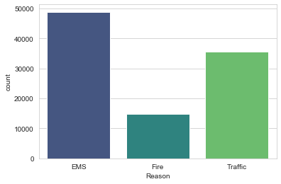
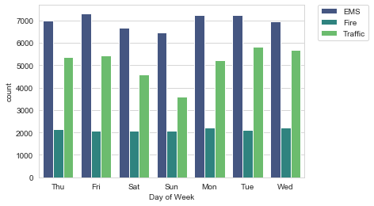
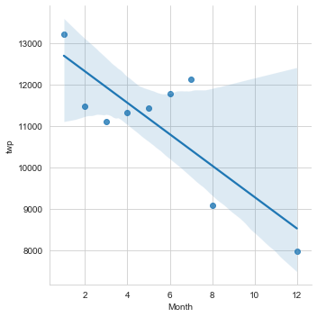

# Llamadas al 911

Para este proyecto final, analizaremos algunos datos de llamadas al 911 de [Kaggle] (https://www.kaggle.com/mchirico/montcoalert). Los datos contienen los siguientes campos:

* lat: String variable, latitud
* lng: String variable, longitud
* desc: String variable, Descripción de la llamada de emergencia
* zip: String variable, código postal
* título: String variable, título
* timeStamp: String variable, AAAA-MM-DD HH: MM: SS
* twp: String variable, municipio
* addr: String variable, dirección
* e: String variable, variable ficticia (siempre 1)

¡Simplemente sigue este cuaderno e intenta completar las instrucciones o responde a las preguntas en negrita, usando tus habilidades de Python y Data Science!

## Datos y Configuración

** Importar numpy and pandas **


```python


```

** Importar las librerias de visualización y %matplotlib inline. **


```python


```

** Carga el archivo "911,csv" en un dataframe llamado df **


```python

```

** Revisa la info() del df **


```python

```

    <class 'pandas.core.frame.DataFrame'>
    RangeIndex: 99492 entries, 0 to 99491
    Data columns (total 9 columns):
     #   Column     Non-Null Count  Dtype  
    ---  ------     --------------  -----  
     0   lat        99492 non-null  float64
     1   lng        99492 non-null  float64
     2   desc       99492 non-null  object
     3   zip        86637 non-null  float64
     4   title      99492 non-null  object
     5   timeStamp  99492 non-null  object
     6   twp        99449 non-null  object
     7   addr       98973 non-null  object
     8   e          99492 non-null  int64  
    dtypes: float64(3), int64(1), object(5)
    memory usage: 6.8+ MB


** Revisa el encabezado **


```python

```


<div>
<table border="1" class="dataframe">
  <thead>
    <tr style="text-align: right;">
      <th></th>
      <th>lat</th>
      <th>lng</th>
      <th>desc</th>
      <th>zip</th>
      <th>title</th>
      <th>timeStamp</th>
      <th>twp</th>
      <th>addr</th>
      <th>e</th>
    </tr>
  </thead>
  <tbody>
    <tr>
      <th>0</th>
      <td>40.297876</td>
      <td>-75.581294</td>
      <td>REINDEER CT &amp; DEAD END;  NEW HANOVER; Station ...</td>
      <td>19525.0</td>
      <td>EMS: BACK PAINS/INJURY</td>
      <td>2015-12-10 17:40:00</td>
      <td>NEW HANOVER</td>
      <td>REINDEER CT &amp; DEAD END</td>
      <td>1</td>
    </tr>
    <tr>
      <th>1</th>
      <td>40.258061</td>
      <td>-75.264680</td>
      <td>BRIAR PATH &amp; WHITEMARSH LN;  HATFIELD TOWNSHIP...</td>
      <td>19446.0</td>
      <td>EMS: DIABETIC EMERGENCY</td>
      <td>2015-12-10 17:40:00</td>
      <td>HATFIELD TOWNSHIP</td>
      <td>BRIAR PATH &amp; WHITEMARSH LN</td>
      <td>1</td>
    </tr>
    <tr>
      <th>2</th>
      <td>40.121182</td>
      <td>-75.351975</td>
      <td>HAWS AVE; NORRISTOWN; 2015-12-10 @ 14:39:21-St...</td>
      <td>19401.0</td>
      <td>Fire: GAS-ODOR/LEAK</td>
      <td>2015-12-10 17:40:00</td>
      <td>NORRISTOWN</td>
      <td>HAWS AVE</td>
      <td>1</td>
    </tr>
  </tbody>
</table>
</div>


## Preguntas Básicas

** ¿Cuáles son los 5 códigos postales (zip) principales de llamadas al 911? **


```python

```


    19401.0    6979
    19464.0    6643
    19403.0    4854
    19446.0    4748
    19406.0    3174
    Name: zip, dtype: int64


** ¿Cuáles son los 5 principales municipios (twp) para llamadas al 911? **


```python

```


    LOWER MERION    8443
    ABINGTON        5977
    NORRISTOWN      5890
    UPPER MERION    5227
    CHELTENHAM      4575
    Name: twp, dtype: int64


** Eche un vistazo a la columna 'title', ¿cuántos códigos de título únicos hay? **


```python

```


    110


## Crear nuevas características

** La columna 'title' es una combinación de la razón de la llamada (por categoría) y una descripción. Las razones son EMS (Emergency Medial Services) , Fire y Traffic. Use .apply () con una expresión lambda personalizada, para crear una nueva columna llamada 'Reason' que contenga este valor. **

**Por ejemplo, si la columna 'title' es EMS: BACK PAINS/INJURY, la columna 'Reason' debe ser EMS. **


```python

```

** ¿Cuál es la razón más común para una llamada al 911, basada en esta nueva columna? **


```python

```


    EMS        48877
    Traffic    35695
    Fire       14920
    Name: Reason, dtype: int64


** Ahora usa seaborn para crear un diagrama de conteo de llamadas al 911 por Reason. **


```python

```


    <matplotlib.axes._subplots.AxesSubplot at 0x22e3773fd68>





** Ahora comencemos a enfocarnos en la información del tiempo. ¿Cuál es el tipo de datos de los objetos en la columna timeStamp? **


```python

```


    str


** Como puedes observar, esta columna de tiempo sigue siendo una cadena. Usa [pd.to_datetime](http://pandas.pydata.org/pandas-docs/stable/generated/pandas.to_datetime.html) para convertir la columna de cadenas a objetos DateTime. **


```python

```

** Ahora puedes obtener atributos específicos de un objeto Datetime llamándolos. Por ejemplo:**

    time = df ['timeStamp']. iloc [0]
    time.hour

** Puedes usar el método de tabulación de Jupyter, para explorar los diversos atributos que se pueden llamar. Ahora que la columna de fecha y hora son en realidad objetos de fecha y hora, usa .apply () para crear 3 nuevas columnas llamadas 'Hour', 'Month' y 'Day of Week'. Crea estas columnas a partir de la columna timeStamp, haz referencia a las soluciones si este paso es demasiado difícil. **


```python


```

** Observa cómo el Día de la semana es un entero entre 0-6. Usa .map () con este diccionario, para asignar los nombres de cadena al día de la semana: **

    dmap = {0:'Mon',1:'Tue',2:'Wed',3:'Thu',4:'Fri',5:'Sat',6:'Sun'}


```python
dmap = {0:'Mon',1:'Tue',2:'Wed',3:'Thu',4:'Fri',5:'Sat',6:'Sun'}
```


```python

```

** Ahora usa seaborn para crear un diagrama de conteo, de la columna 'Day of Week' con el tono basado en la columna 'Reason'. **


```python


```


    <matplotlib.legend.Legend at 0x22e37c76780>





** Haz lo mismo para 'Month'**


```python


```


    <matplotlib.legend.Legend at 0x11fa7ad68>


** ¿Notaste algo extraño en el gráfico? **


```python
# Faltan algunos meses. 9, 10 y 11 no están allí.
```

** Deberías haber notado que faltaban algunos meses, veamos si tal vez podemos completar esta información trazando la información de otra manera; posiblemente un diagrama lineal simple que complete los meses faltantes. Para hacer esto, ' Necesitaremos trabajar con pandas ... **

** Ahora crea dataframe llamado 'byMonth' mediante groupby usando 'Month', donde se agrupe el dataframe por la columna 'Month' y usa el método count () para la agregación. Usa el método head () en este DataFrame, para verificar que es correcto. **


```python


```


<div>
<table border="1" class="dataframe">
  <thead>
    <tr style="text-align: right;">
      <th></th>
      <th>lat</th>
      <th>lng</th>
      <th>desc</th>
      <th>zip</th>
      <th>title</th>
      <th>timeStamp</th>
      <th>twp</th>
      <th>addr</th>
      <th>e</th>
      <th>Reason</th>
      <th>Hour</th>
      <th>Day of Week</th>
    </tr>
    <tr>
      <th>Month</th>
      <th></th>
      <th></th>
      <th></th>
      <th></th>
      <th></th>
      <th></th>
      <th></th>
      <th></th>
      <th></th>
      <th></th>
      <th></th>
      <th></th>
    </tr>
  </thead>
  <tbody>
    <tr>
      <th>1</th>
      <td>13205</td>
      <td>13205</td>
      <td>13205</td>
      <td>11527</td>
      <td>13205</td>
      <td>13205</td>
      <td>13203</td>
      <td>13096</td>
      <td>13205</td>
      <td>13205</td>
      <td>13205</td>
      <td>13205</td>
    </tr>
    <tr>
      <th>2</th>
      <td>11467</td>
      <td>11467</td>
      <td>11467</td>
      <td>9930</td>
      <td>11467</td>
      <td>11467</td>
      <td>11465</td>
      <td>11396</td>
      <td>11467</td>
      <td>11467</td>
      <td>11467</td>
      <td>11467</td>
    </tr>
    <tr>
      <th>3</th>
      <td>11101</td>
      <td>11101</td>
      <td>11101</td>
      <td>9755</td>
      <td>11101</td>
      <td>11101</td>
      <td>11092</td>
      <td>11059</td>
      <td>11101</td>
      <td>11101</td>
      <td>11101</td>
      <td>11101</td>
    </tr>
    <tr>
      <th>4</th>
      <td>11326</td>
      <td>11326</td>
      <td>11326</td>
      <td>9895</td>
      <td>11326</td>
      <td>11326</td>
      <td>11323</td>
      <td>11283</td>
      <td>11326</td>
      <td>11326</td>
      <td>11326</td>
      <td>11326</td>
    </tr>
    <tr>
      <th>5</th>
      <td>11423</td>
      <td>11423</td>
      <td>11423</td>
      <td>9946</td>
      <td>11423</td>
      <td>11423</td>
      <td>11420</td>
      <td>11378</td>
      <td>11423</td>
      <td>11423</td>
      <td>11423</td>
      <td>11423</td>
    </tr>
  </tbody>
</table>
</div>


** Ahora crea un diagrama simple con el dataframe, que indique el recuento de llamadas por mes. **


```python


```


    <matplotlib.axes._subplots.AxesSubplot at 0x22e36f74fd0>


** Ahora revisa si puedes usar lmplot () de seaborn, para crear un ajuste lineal en la cantidad de llamadas por mes. Ten en cuenta que es posible que debas restablecer el índice a una columna. **


```python

```


    <seaborn.axisgrid.FacetGrid at 0x22e3706c2b0>





** Crea una nueva columna llamada 'Date', que contenga la fecha de la columna timeStamp. Deberá usar apply junto con el método .date (). **


```python

```

** Ahora agrupa por esta columna 'Date' con el agregado count () y crea un diagrama de recuentos de llamadas al 911. **


```python


```


** Ahora recrea el gráfico, pero ahora crea 3 gráficos separados para representar el motivo de la llamada al 911 **


```python


```


```python


```


```python


```


____
** Ahora pasemos a crear mapas de calor con seaborn y nuestros datos. Primero tendremos que reestructurar el dataframe, para que las columnas se conviertan en las horas y el índice se convierta en el día de la semana. Hay muchas maneras de hacer esto, pero recomendaría intentar combinar groupby con un método [unstack] (http://pandas.pydata.org/pandas-docs/stable/generated/pandas.DataFrame.unstack.html) . ¡Consulta las soluciones si esto es demasiado complicado! **


```python


```


<div>
<table border="1" class="dataframe">
  <thead>
    <tr style="text-align: right;">
      <th>Hour</th>
      <th>0</th>
      <th>1</th>
      <th>2</th>
      <th>3</th>
      <th>4</th>
      <th>5</th>
      <th>6</th>
      <th>7</th>
      <th>8</th>
      <th>9</th>
      <th>...</th>
      <th>14</th>
      <th>15</th>
      <th>16</th>
      <th>17</th>
      <th>18</th>
      <th>19</th>
      <th>20</th>
      <th>21</th>
      <th>22</th>
      <th>23</th>
    </tr>
    <tr>
      <th>Day of Week</th>
      <th></th>
      <th></th>
      <th></th>
      <th></th>
      <th></th>
      <th></th>
      <th></th>
      <th></th>
      <th></th>
      <th></th>
      <th></th>
      <th></th>
      <th></th>
      <th></th>
      <th></th>
      <th></th>
      <th></th>
      <th></th>
      <th></th>
      <th></th>
      <th></th>
    </tr>
  </thead>
  <tbody>
    <tr>
      <th>Fri</th>
      <td>275</td>
      <td>235</td>
      <td>191</td>
      <td>175</td>
      <td>201</td>
      <td>194</td>
      <td>372</td>
      <td>598</td>
      <td>742</td>
      <td>752</td>
      <td>...</td>
      <td>932</td>
      <td>980</td>
      <td>1039</td>
      <td>980</td>
      <td>820</td>
      <td>696</td>
      <td>667</td>
      <td>559</td>
      <td>514</td>
      <td>474</td>
    </tr>
    <tr>
      <th>Mon</th>
      <td>282</td>
      <td>221</td>
      <td>201</td>
      <td>194</td>
      <td>204</td>
      <td>267</td>
      <td>397</td>
      <td>653</td>
      <td>819</td>
      <td>786</td>
      <td>...</td>
      <td>869</td>
      <td>913</td>
      <td>989</td>
      <td>997</td>
      <td>885</td>
      <td>746</td>
      <td>613</td>
      <td>497</td>
      <td>472</td>
      <td>325</td>
    </tr>
    <tr>
      <th>Sat</th>
      <td>375</td>
      <td>301</td>
      <td>263</td>
      <td>260</td>
      <td>224</td>
      <td>231</td>
      <td>257</td>
      <td>391</td>
      <td>459</td>
      <td>640</td>
      <td>...</td>
      <td>789</td>
      <td>796</td>
      <td>848</td>
      <td>757</td>
      <td>778</td>
      <td>696</td>
      <td>628</td>
      <td>572</td>
      <td>506</td>
      <td>467</td>
    </tr>
    <tr>
      <th>Sun</th>
      <td>383</td>
      <td>306</td>
      <td>286</td>
      <td>268</td>
      <td>242</td>
      <td>240</td>
      <td>300</td>
      <td>402</td>
      <td>483</td>
      <td>620</td>
      <td>...</td>
      <td>684</td>
      <td>691</td>
      <td>663</td>
      <td>714</td>
      <td>670</td>
      <td>655</td>
      <td>537</td>
      <td>461</td>
      <td>415</td>
      <td>330</td>
    </tr>
    <tr>
      <th>Thu</th>
      <td>278</td>
      <td>202</td>
      <td>233</td>
      <td>159</td>
      <td>182</td>
      <td>203</td>
      <td>362</td>
      <td>570</td>
      <td>777</td>
      <td>828</td>
      <td>...</td>
      <td>876</td>
      <td>969</td>
      <td>935</td>
      <td>1013</td>
      <td>810</td>
      <td>698</td>
      <td>617</td>
      <td>553</td>
      <td>424</td>
      <td>354</td>
    </tr>
  </tbody>
</table>
<p>5 rows × 24 columns</p>
</div>


** Ahora crea un HeatMap usando este nuevo DataFrame. **


```python


```


    <matplotlib.axes._subplots.AxesSubplot at 0x22e37e08198>


** Ahora crea un mapa de clúster con este DataFrame. **


```python

```


    <seaborn.matrix.ClusterGrid at 0x22e37d86898>


** Ahora repite estos mismos gráficos y operaciones, para un DataFrame que muestra el Mes como la columna. **


```python


```


<div>
<table border="1" class="dataframe">
  <thead>
    <tr style="text-align: right;">
      <th>Month</th>
      <th>1</th>
      <th>2</th>
      <th>3</th>
      <th>4</th>
      <th>5</th>
      <th>6</th>
      <th>7</th>
      <th>8</th>
      <th>12</th>
    </tr>
    <tr>
      <th>Day of Week</th>
      <th></th>
      <th></th>
      <th></th>
      <th></th>
      <th></th>
      <th></th>
      <th></th>
      <th></th>
      <th></th>
    </tr>
  </thead>
  <tbody>
    <tr>
      <th>Fri</th>
      <td>1970</td>
      <td>1581</td>
      <td>1525</td>
      <td>1958</td>
      <td>1730</td>
      <td>1649</td>
      <td>2045</td>
      <td>1310</td>
      <td>1065</td>
    </tr>
    <tr>
      <th>Mon</th>
      <td>1727</td>
      <td>1964</td>
      <td>1535</td>
      <td>1598</td>
      <td>1779</td>
      <td>1617</td>
      <td>1692</td>
      <td>1511</td>
      <td>1257</td>
    </tr>
    <tr>
      <th>Sat</th>
      <td>2291</td>
      <td>1441</td>
      <td>1266</td>
      <td>1734</td>
      <td>1444</td>
      <td>1388</td>
      <td>1695</td>
      <td>1099</td>
      <td>978</td>
    </tr>
    <tr>
      <th>Sun</th>
      <td>1960</td>
      <td>1229</td>
      <td>1102</td>
      <td>1488</td>
      <td>1424</td>
      <td>1333</td>
      <td>1672</td>
      <td>1021</td>
      <td>907</td>
    </tr>
    <tr>
      <th>Thu</th>
      <td>1584</td>
      <td>1596</td>
      <td>1900</td>
      <td>1601</td>
      <td>1590</td>
      <td>2065</td>
      <td>1646</td>
      <td>1230</td>
      <td>1266</td>
    </tr>
  </tbody>
</table>
</div>


```python


```


    <matplotlib.axes._subplots.AxesSubplot at 0x22e38256940>


```python

```


    <seaborn.matrix.ClusterGrid at 0x22e37dddba8>


** ¡Continúa explorando los datos como mejor te parezca! **
# ¡Gran trabajo!

[**Proyecto Solución**](02%20Proyecto%20llamadas%20al%20911%20-%20Solucion.ipynb)  
